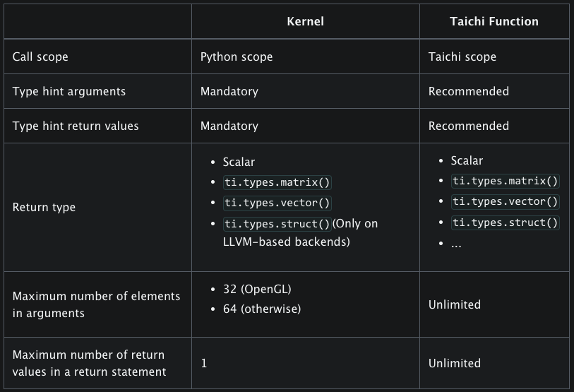

# Kernels & Functions

## 修饰器

在Taichi中有两个重要的修饰器，`ti.func`和`ti.kernel`，分别代表Taichi function和Taichi kernel，Taichi function和Taichi kernel不由Python的解释器执行，而是由Taichi的JIT编译器执行计算，并部署到并行的多核CPU或GPU上

!!! tip "Tip"
    如果熟悉CUDA编程的话，`ti.func`可以等效为CUDA中的`__device__`，`ti.kernel`可以等效为CUDA中的`__global__`

!!! example "Example"
    ```python
    import taichi as ti
    ti.init(arch=ti.cpu)

    @ti.func
    def inv_square(x):  # A Taichi function
        return 1.0 / (x * x)

    @ti.kernel
    def partial_sum(n: int) -> float:  # A kernel
        total = 0.0
        for i in range(1, n + 1):
            total += inv_square(n)
        return total

    partial_sum(1000)
    ```

## Taichi kernel

Taichi kernel是Taichi接管执行任务的入口，可以在程序的任何地方被调用

### 参数

一个Taichi kernel可以接受多个参数，但不意味着任意Python对象都可以传给kernel，因为Python对象可以是动态的，并且可能包含Taichi的编译器无法识别的类型

Taichi kernel支持的类型有这几种：`scalar`, `ti.types.matrix()`, `ti.types.vector()`, `ti.types.struct()`, `ti.types.ndarray()`, 和`ti.template()`

其中`scalar`, `ti.types.matrix()`, `ti.types.vector()`, 和`ti.types.struct()` 是值传递, kernel会接收参数的拷贝值；而`ti.types.ndarray()`和`ti.template()`是传引用值, 在kernel中修改会影响原来的数据

!!! example "Example"
    ```python
    @ti.kernel
    def my_kernel(x: int, y: float):
        print(x + y)

    my_kernel(1, 1.0)  # Prints 2.0
    ```

可以使用`ti.types.ndarray()`作为类型提示，将NumPy中的ndarray或PyTorch中的tensor传给kernel，传的是引用值

!!! example "Example"
    ```python
    import numpy as np
    import taichi as ti
    ti.init(arch=ti.cpu)

    x = np.array([1, 2, 3])
    y = np.array([4, 5, 6])

    @ti.kernel
    def my_kernel(x: ti.types.ndarray(), y: ti.types.ndarray()):
        # Taichi recognizes the shape of the array x and allows you to access it in a kernel
        for i in range(x.shape[0]):
            x[i] += y[i]

    my_kernel(x, y)
    print(x)  # Prints [5, 7, 9]
    ```

### 返回值

Taichi kernel最多允许有一个返回值，返回值类型可以是`scalar`, `ti.types.matrix()`, 或`ti.types.vector()`，如果使用LLVM-based的后端（CPU/CUDA），`ti.types.struct()`也可以使用

概括来说Taichi kernel的返回值，必须符合以下规则：

- kernel的返回值必须声明类型
- kernel最多允许一个返回值
    ```python
    vec2 = ti.math.vec2

    @ti.kernel
    def test(x: float, y: float) -> vec2: # Return value must be type hinted
        # Return x, y  # Compilation error: Only one return value is allowed
        return vec2(x, y)  # Fine
    ```

- kernel最多允许一个`return`语句
- 如果kernel的返回值是vector或matrix，它不能包含超过32个元素，如果包含超过32个元素，kernel仍将被编译，但会出现warning

### 全局变量

在Taichi中，kernel将全局变量视为编译时常量(compile-time constants)，这表示kernel在编译时会获取全局变量的当前值，并且之后不会跟踪它们的更改

!!! example "Example"
    ```python
    import taichi as ti
    ti.init()

    a = 1

    @ti.kernel
    def kernel_1():
        print(a)

    @ti.kernel
    def kernel_2():
        print(a)

    kernel_1()  # Prints 1
    a = 2
    kernel_1()  # Prints 1
    kernel_2()  # Prints 2
    ```

## Taichi function

Taichi function是kernel的基本单位，只能从Taichi kernel或另一个Taichi function中被调用

> 所有的Taichi function是**强制内联(force-inlined)**的，因此在被Taichi function调用是会完全展开，所以Taichi function的递归调用是不允许的

### 参数

大部分的类型都是支持的，和Taichi kernel的参数相比，以下几点需要注意：

- 不严格要求指定参数类型(但仍然建议这样做)
- 对参数的数量没有限制

### 返回值

大部分的类型都是支持的，和Taichi kernel的返回值相比，以下几点需要注意：

- 可以有多个返回值
- 不严格要求指定返回值类型(但仍然建议这样做)
- 最多只能有一个`return`语句

## Taichi function和kernel的区别

Taichi function和kernel的区别如下表所示：

<figure markdown>
  { width="600" }
  <figcaption>Taichi function和kernel的区别</figcaption>
</figure>

## 循环的并行运算

Taichi kernel里最外层的任何for循环都会自动并行化
```python
@ti.kernel
def fill():
    total = 0
    for i in range(10): # Parallelized
        for j in range(5): # Serialized in each parallel thread
            total += i * j

    if total > 10:
        for k in range(5):  # Not parallelized because it is not at the outermost scope
```

!!! warning "Warning"
    并行计算的循环中不支持`break`语句

    ```python
    @ti.kernel
    def foo():
        for i in x:
            ...
            break # Error!

    @ti.kernel
    def foo():
        for i in x:
            for j in range(10):
                ...
                break # OK!
    ```
通过`ti.loop_config(serialize=True)`的设置可以禁用自动并行化

Taichi的循环还有一个很好用的特性，使用`ti.grouped(x)`将会把`x`作为一个1D数组来遍历它的元素，而不管它的形状，从而避免了写多级循环，下面是一个例子:

!!! example "Example"
    ```python
    import taichi as ti
    ti.init(arch=ti.cpu)
    x = ti.field(ti.f32, shape=(2, 2))

    @ti.kernel
    def loop_test():
        count = 0
        for i in ti.grouped(x):
            print(i)
            count += 1
        print(f"all count: {count}")

    if __name__ == "__main__":
        loop_test()
    ```

    输出结果如下：
    ```python
    [0, 0]
    [0, 1]
    [1, 0]
    [1, 1]
    all count: 4
    ```
> ti.grouped(x) 不可以在Python-scope使用，只能在Taichi-scope使用
