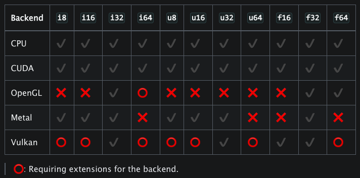
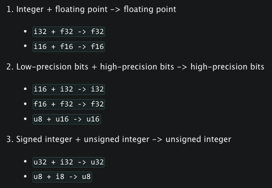

# Type System

Taichi是一门静态类型的编程语言，Taichi中的变量类型是在编译时就确定的，一旦声明了变量，就不能再为其分配不同类型的值。

!!! example "Example"
    ```python
    @ti.kernel
    def test():
        x = 1  # x is the integer 1
        x = 3.14  # x is an integer, so the value 3.14 is cast to 3 and x takes the value 3
        x = ti.Vector([1, 1])  # Error!
    ```

> 上述代码的最后一行会报错，因为`ti.Vector()`类型的值不能赋值给变量`x`

Taichi中的`ti.types`模块定义了所有Taichi支持的数据类型，这些数据类型分为两类: 基本类型(primitive)和复合类型(compound)

- 基本类型包括常用的数值数据类型，比如`ti.i32(int32)`, `ti.u8(uint8)`,和`ti.f64(float64)`
- 复合类型包括类似数组或类似结构的数据类型，这些类型由多个成员组成，这些成员可以是基本类型，也可以是其他复合类型，比如`ti.types.matrix`, `ti.types.ndarray`, 和`ti.types.struct`

## 基本类型

用`i`表示有符号整数，`u`表示无符号整数，`f`表示浮点数，后面跟的位数可以是8，16，32，64，最常用的两种基本类型为

- `i32`: 32位有符号整数，也是默认的整数类型
- `f32`: 32位浮点数，也是默认的浮点数类型

需要注意，不同backend对Taichi基本类型的支持会有所不同，详见下表：

<figure markdown>
  { width="600" }
  <figcaption>不同backend对基本类型的支持对比</figcaption>
</figure>

Taichi允许在调用`ti.init()`时指定默认的基本数据类型，用法如下：

```python
ti.init(default_ip=ti.i64)  # Sets the default integer type to ti.i64
ti.init(default_fp=ti.f64)  # Sets the default floating-point type to ti.f64
```

> 在应用中如果要保持数据的高精度，建议将`default_fp`设置为`ti.F64`

### 数据类型别名

在Taichi scope中，`int`和`float`会被分别用作默认整数和浮点类型的别名

```python
ti.init(default_ip=ti.i64, default_fp=ti.f64)

@ti.kernel
def example_cast() -> int:  # the returned type is ti.i64
    x = 3.14    # x is of ti.f64 type
    y = int(x)  # equivalent to ti.i64(x)
    return y
```

在Python scope中，创建一个Taichi的data container并指定类型时，使用的也是别名

```python
x = ti.field(float, 5)
# Is equivalent to:
x = ti.field(ti.f64, 5)
```

> 除了Taichi scope和Python scope创建的Taichi data container以外，`int`和`float`作为Python中的内置函数

### 显式类型转换

可以用`ti.cast()`函将给定值转换为特定的目标类型

```python
@ti.kernel
def foo():
    a = 3.14
    b = ti.cast(a, ti.i32)  # 3
    c = ti.cast(b, ti.f32)  # 3.0
```

还有一种更方便的方式，使用基本类型直接转换

```python
@ti.kernel
def foo():
    a = 3.14
    x = int(a)    # 3
    y = float(a)  # 3.14
    z = ti.i32(a)  # 3
    w = ti.f64(a)  # 3.14
```

### 隐式类型转换

在Taichi里，隐式类型转换发生在二元操作和赋值操作中

!!! warning "Warning"
    隐式类型转换通常是bug产生的来源，因此不推荐使用隐式类型转换，而是显式地指定变量类型和传入的数据

隐式类型转换的规则如下：

<figure markdown>
  { width="600" }
  <figcaption>隐式类型转换的规则</figcaption>
</figure>

有一些例外：

- 逻辑运算的返回值类型为`i32`
- 比较运算的返回值类型为`i32`

**赋值操作中发生的隐式类型转换**

!!! example "Example1"
    ```python
    @ti.kernel
    def foo():
        a = 3.14
        a = 1
        print(a)  # 1.0
    ```

> 将变量`a`的值从`int 1`转成`float 1.0`

!!! example "Example2"
    ```python
    @ti.kernel
    def foo():
        a = 1
        a = 3.14
        print(a)  # 3
    ```

> 将变量`a`的值从`float 3.14`转成`int 3`

由此可见，**初始化时的变量类型**决定了隐式类型转换的结果

## 复合类型

### 矩阵和向量

可以用`ti.types.matrix()`和`ti.types.vector()`来自定义创建矩阵和向量数据类型

!!! example "Example"

    ```python
    vec4d = ti.types.vector(4, ti.f64)  # a 64-bit floating-point 4D vector type
    mat4x3i = ti.types.matrix(4, 3, int)  # a 4x3 integer matrix type
    ```

在上述代码中，我们分别创建了两个类型

- `vec4d`: 元素为64位浮点数的4维向量类型
- `mat4x3i`: 元素为整数的4x3矩阵类型

可以利用自定义的复合类型来实例化向量和矩阵，以及作为函数参数的数据类型

!!! example "Example"

    ```python
    v = vec4d(1, 2, 3, 4)  # Create a vector instance, here v = [1.0 2.0 3.0 4.0]

    @ti.func
    def length(w: vec4d):  # vec4d as type hint
        return w.norm()

    @ti.kernel
    def test():
        print(length(v))
    ```

### 结构体和数据类(dataclass)

可以用`ti.types.struct()`函数来创建一个结构体类型，以下是一个创建球体类型(`sphere_type`)的例子

!!! example "Example"

    ```python
    # Define a compound type vec3 to represent a sphere's center
    vec3 = ti.types.vector(3, float)
    # Define a compound type sphere_type to represent a sphere
    sphere_type = ti.types.struct(center=vec3, radius=float)
    # Initialize sphere1, whose center is at [0,0,0] and whose radius is 1.0
    sphere1 = sphere_type(center=vec3([0, 0, 0]), radius=1.0)
    # Initialize sphere2, whose center is at [1,1,1] and whose radius is 1.0
    sphere2 = sphere_type(center=vec3([1, 1, 1]), radius=1.0)
    ```

如果定义的结构体有很多成员变量的时候，使用`ti.types.struct`会导致代码混乱、组织性很差，这个时候可以用一个修饰器`ti.dataclass`，它包装了struct类型

!!! example "Example"

    ```python
    @ti.dataclass
    class Sphere:
        center: vec3
        radius: float
    ```

使用`ti.dataclass`还可以让我们在数据类中定义成员函数，从而实现OOP的功能

### 初始化

Taichi中有很多初始化struct或者dataclass的方式，除了直接调用类型进行实例化之外，还可以用以下几种方式：

- 按照**定义的参数顺序**将位置参数传递给类型
- 利用**关键字参数**设置特定的成员变量
- 未指定的成员变量将被自动设置为0

!!! exampole "Example"

    ```python
    @ti.dataclass
    class Ray:
        ro: vec3
        rd: vec3
        t: float

    # The definition above is equivalent to
    #Ray = ti.types.struct(ro=vec3, rd=vec3, t=float)
    # Use positional arguments to set struct members in order
    ray = Ray(vec3(0), vec3(1, 0, 0), 1.0)
    # ro is set to vec3(0) and t will be set to 0
    ray = Ray(vec3(0), rd=vec3(1, 0, 0))
    # both ro and rd are set to vec3(0)
    ray = Ray(t=1.0)
    # ro is set to vec3(1), rd=vec3(0) and t=0.0
    ray = Ray(1)
    # All members are set to 0
    ray = Ray()
    ```

### 类型转换

目前Taichi的复合类型中只有vector和matrix支持类型转换，并且是element-wise的

!!! example "Example"
    ```python
    @ti.kernel
    def foo():
        u = ti.Vector([2.3, 4.7])
        v = int(u)              # ti.Vector([2, 4])
        # If you are using ti.i32 as default_ip, this is equivalent to:
        v = ti.cast(u, ti.i32)  # ti.Vector([2, 4])
    ```

