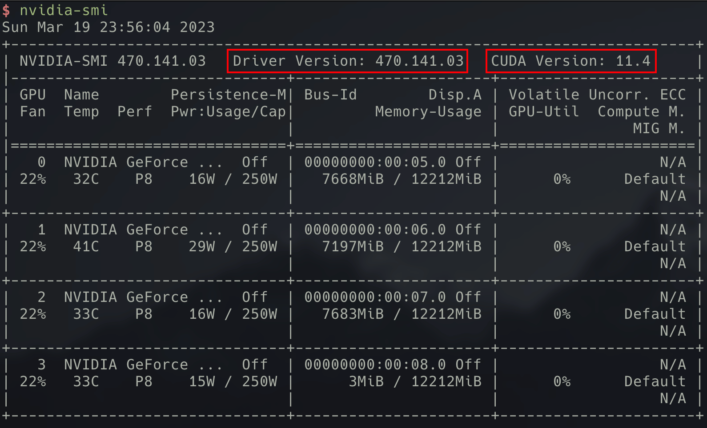

# Pytorch

!!! abstract "Abstract"
    最近在复现论文，在这里记录一些 Pytorch 相关的内容以及一些有用的 tricks

    - 官方教程：[Pytorch Tutorial](https://pytorch.org/tutorials/)
    - 官方文档：[Pytorch documentation](https://pytorch.org/docs/stable/index.html)
    - Cheet Sheet: [Pytorch Cheet Sheet](https://pytorch.org/tutorials/beginner/ptcheat.html)

## 安装

推荐使用 Anaconda/Miniconda 创建虚拟环境安装 Pytorch

> 如果你需要使用 CPU 版本的 Pytorch，那么以下的复杂步骤都不需要做，只需要运行以下指令即可安装
>
> ```sh
> pip3 install torch torchvision torchaudio               # pip
> conda install pytorch torchvision torchaudio cpuonly    # conda
> ```

正确的安装流程如下:

- 在终端输入`nvidia-smi`查看 NVIDIA 驱动的版本和支持的 CUDA 的最高版本

<figure markdown>
  {width = 200}
  <figcaption></figcaption>
</figure>

- 在终端输入`nvcc -V`查看本机安装的 CUDA 版本，如果提示该命令不存在，则需要去 [NVIDIA 官网](https://developer.nvidia.com/cuda-downloads) 下载 CUDA

  ```sh
  $ nvcc -V
  nvcc: NVIDIA (R) Cuda compiler driver
  Copyright (c) 2005-2021 NVIDIA Corporation
  Built on Fri_Dec_17_18:28:54:_Pacific_Standard_Time_2021
  Cuda compilation tools, release 11.2, V11.2.152
  Build cuda_11.2.r11.2/compiler.30794723_0
  ```

- 安装对应 CUDA 版本的 cudnn，官方下载地址为 [cudnn download](https://developer.nvidia.com/rdp/cudnn-download)
- 下载 Anaconda/Miniconda，创建一个环境（e.g. pytorch)，<br>Conda 的配置和使用可以参考 [Conda 备忘录](../conda/index.md)
- 在 [Pytoch 官方](https://pytorch.org/get-started/locally/) 找到对应平台和 CUDA 版本的安装指令(e.g. cuda11.1)

```sh
conda install pytorch torchvision torchaudio pytorch-cuda=11.2 -c pytorch -c nvidia
```

- 安装完 Pytorch 后我们需要检验安装是否成功，且版本是否正确

```py
>>> import torch
>>> torch.__version__
'1.12.1'
>>> torch.cuda.is_available()
True
>>> torch.cuda.get_device_name()
'NVIDIA GeForce GTX 1660 Ti'
>>> from torch.backends import cudnn
>>> cudnn.is_available()
True
```

如果执行上述指令看到的结果一致，那么 Pytorch 的安装已经成功了

最后可以安装一些深度学习常用的 Python 包

```
pyyaml
tqdm
plyfile
tensorboardX
jupyter
pandas
matplotlib
numpy
scipy
```

## 基本语法

## 常用模块

## TensorBoard

现在推荐使用的是 lanpa 大佬开发的[tensorboardX](https://github.com/lanpa/tensorboardX)，这是一个完全支持 PyTorch 的 tensorboard 工具包，从而让 PyTorch 很好地调用 tensorboard 的数据可视化工具来监控神经网络训练的过程。

>官方文档：[tensorboardX’s documentation](https://tensorboardx.readthedocs.io/en/latest/index.html)
>
>官方仓库：[Github repo](https://github.com/lanpa/tensorboardX)

### 安装

```sh
pip install tensorboardX
```

### 使用

我们需要用到 tensorboardX 中的一个类，叫做`SummaryWriter`

#### 初始化

```py
from tensorboardX import SummaryWriter

# 初始化，可以指定路径
writer1 = SummaryWriter()
writer2 = SummaryWriter("./logs")
```

#### 记录数据

```py
writer.add_scalar(tag, scalar_value, global_step=None, walltime=None)
```

- **tag**: 数据标签，不同标签的数据使用不同曲线绘制
- **scalar_value**: 常量值
- **global_step**: 训练的 step
- **walltime**: 记录时间，默认为 time.time()

> 需要注意，这里的 scalar_value 必须为 **float** 类型，如果是 scalar tensor，则需要调用`tensor.item()`方法获取其数值

我们一般会使用`add_scalar`方法来记录训练过程的 loss、accuracy、learning rate 等数值的变化，直观地监控训练过程

```py
writer.add_scalar('Train/Loss', loss.data[0], niter)
writer.add_scalar('Test/Accu', correct/total, niter)
```

#### 运行图

我们可以使用`add_graph`方法来添加一个运行图，可视化一个神经网络

```py
writer.add_graph(model, input_to_model=None, verbose=False, **kwargs)
```

- **model**: 待可视化的网络模型
- **input\_to\_model**: 待输入神经网络的变量

#### 添加图片

我们可以使用`add_image`方法来可视化一张图片

```py
writer.add_image(tag, img_tensor, global_step=None, walltime=None, dataformats='CHW')
```

- **tag**: 数据标签
- **img_tensor**: 图像数据，是多维 tensor
- **global_step**: 训练的 step
- **walltime**: 记录时间，默认为 time.time()

#### 嵌入向量

我们可以使用`add_embedding`方法在二维或三维空间可视化 embedding 向量

```py
writer.add_embedding(mat, metadata=None, label_img=None, global_step=None, tag='default', metadata_header=None)
```

- **mat**: 二维矩阵，每行代表特征空间的一个数据点
- **metadata**: 一维列表，表示 mat 中每行数据的 label，大小应和 mat 行数相同
- **label_img**: 形如 NxCxHxW 的四维 tensor，对应 mat 中每一行数据显示出的图像，N 应和 mat 行数相同
- **global_step**: 训练的 step
- **tag**: 数据标签

#### 导出

```py
# export scalar data to JSON for external processing
writer.export_scalars_to_json("./all_scalars.json")
writer.close()
```

#### 登陆

在命令行中运行以下指令即可打开 tensorboard

```sh
# --port 可以指定打开的端口
tensorboard --logdir=logs --port=6007
```
