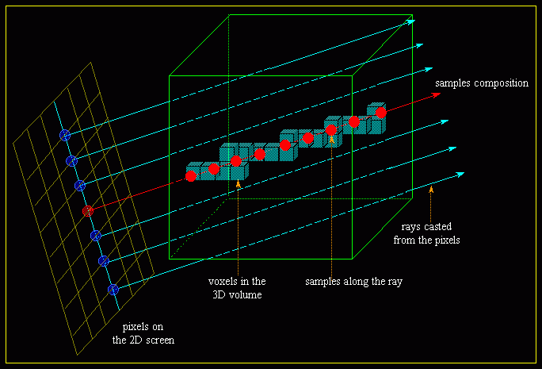

# NeRF 论文笔记

!!! abstract "Abstract"
    NeRF 论文的阅读笔记录在这里

    
-- By @Zicx

## NeRF 是做什么的

通过使用稀疏的输入视图优化底层的的连续辐射体积场函数，实现**复杂场景的新视角合成**

## NeRF 是怎么做的

<figure markdown>
  { width=650 }
  <figcaption>Fig1. NeRF Pipeline</figcaption>
</figure>

### 一、Pipeline
- a).沿着相机光线的方向采样 5D 坐标
- b).将坐标信息输入到 MLP 中，产生颜色和体积密度
- c).使用立体渲染将颜色和体积密度合成为图像
- d).渲染函数是可微分的，因此可以通过最小化合成图像和实际观察到的图像之间的残差来优化场景表示

### 二、静态场景的表示

- 使用全连接（非卷积）深度网络(多层感知机，MLP)来表示场景
- 输入是一个连续的5D坐标：**空间位置 $(x,y,z)$** 和 **2D 观察方向$(\theta, \phi)$**
- 输出是该空间位置的**体积密度 $\sigma$ 和视角相关的颜色 $\textbf{c} = (r,g,b)$**

???+ note "Note"
    这里的体积密度只对某一个空间点$(x,y,z)$ 而言，它表示一条穿过空间点$(x,y,z)$ 的射线累计了多少辐射(radiance)，后面会将它转化为概率密度

**多视图之间的连续一致性**

- 体积密度 $\sigma$ 函数只与空间位置 $\mathbf{x}$ 有关 --> $\sigma(\mathbf{x})$
- 颜色 $c$ 函数与空间位置 $\mathbf{x}$ 和视角 $\mathbf{d}$ 都有关 --> $c(\mathbf{x},\mathbf{d})$
 
**MLP 的设计**

- 用 8 个全连接层来处理输入的空间坐标 $x$ (激活函数为 ReLU，每层256个通道)
- 输出 $\sigma$ 和一个 256 维的特征向量
- 将特征向量和视角方向 $d$ 连接起来
- 传递到一个额外的全连接层 (激活函数为 ReLU，128个通道)
- 输出依赖于视图的 RGB 颜色

**MLP 的 Loss 计算**

$$
\mathcal{L}=\sum_{\mathbf{r} \in \mathcal{R}}\left[\left\|\hat{C}_c(\mathbf{r})-C(\mathbf{r})\right\|_2^2+\left\|\hat{C}_f(\mathbf{r})-C(\mathbf{r})\right\|_2^2\right]
$$

- 用了两个 MLP 网络，分别是**粗(coarse) 网络和细(fine) 网络**
> 后续**优化的部分**会具体解释粗网络和细网络
- $\mathcal{R}$ 是每个 batch 里面光线的集合，$\mathbf{r}$ 是指集合里面的每一条光线 
- $C(\mathbf{r})$，$\hat{C}_c(\mathbf{r})$，$\hat{C}_f(\mathbf{r})$ 分别是实景，粗网络，细网络中输出的光线 RGB 颜色
- 同时还将 $\hat{C}_c(\mathbf{r})$ 的损失最小化，以便粗网络的权重分布可以用于在细网络中分配样本
 
### 三、神经渲染
 
- 沿着相机光线查询 5D 坐标来合成视图
- 使用**立体渲染**将输出颜色和密度投影到 2D 图像中

从特定的视角渲染 NeRF 的过程

- 利用穿过场景的相机光线，生成一组采样的三维点 $P_{3D}$
- 利用三维点和对应的 2D 视角方向作为 MLP 的输入，输出密度和颜色
- 使用立体渲染技术将输出颜色和密度累积到一个二维图像 $I_{2D}$ 中
 
> 由于具有可微性，所以可以利用**梯度下降**的方法来优化 MLP 网络，**最小化每个观察图像和 NeRF 渲染出来的相应视图之间的误差**

该部分详细内容参见 [NeRF 的数学推导](./math.md)

光线可以表示为一个 3D 空间坐标

$$
\mathbf{r}(t) = \mathbf{o} + t \mathbf{d}
$$

???+ tip "Attention"
    原文中的一些假设：

    1. 场景是由一团发光粒子组成的，这里粒子密度的空间分布会发生变化**
    2. 发射的光（每一个体素都会向四周均匀发出光）不随观察视角而改变**

假设**距离** $t$ 的近场边界和远场边界分别为 $t_n$ 和 $t_f$ ，那么对于一条射线，它的期望颜色表达式应该如下：

$$
C(\mathbf{r})=\int_{t_n}^{t_f} T(t) \sigma(\mathbf{r}(t)) \mathbf{c}(\mathbf{r}(t), \mathbf{d}) d t, \text{ where } T(t)=\exp \left(-\int_{t_n}^t \sigma(\mathbf{r}(s)) d s\right)
$$

函数 $T(t)$ 表示的是光线在 $t_n$ 到 $t$ 距离内的透射率，即光线在不碰到任何其他粒子的情况下能够传播的概率

一张示例图：

<figure markdown>
  { width="500" }
  <figcaption>Fig2. Light Sampling in 3D Space.</figcaption>
</figure>

从连续的 NeRF 中渲染视图需要估计相机光线追踪的每个像素的积分 $C(\mathbf{r})$

> *这个很好理解，因为 2D 图像的每一个像素值实际上是相机发出的一条射线上的所有点累积叠加的结果*

文中估计积分的方法是 [数值积分(Quadrature)](https://zh.wikipedia.org/wiki/%E9%AB%98%E6%96%AF%E6%B1%82%E7%A7%AF)
简单来说，就是分层抽样，把 $[t_n, t_f]$ 等分成 $\mathbf{N}$ 个区间，然后从每个区间内均匀随机地抽取一个样本

$$
t_i \sim \mathcal{U}\left[t_n+\frac{i-1}{N}\left(t_f-t_n\right), t_n+\frac{i}{N}\left(t_f-t_n\right)\right] \quad i =1,2,...N
$$

> 这里得到的 $t_i$ 是每个小区间内的随机抽取样本点的空间坐标

根据数值积分方法估计的颜色积分结果如下所示：

$$
\hat{C}(\mathbf{r})=\sum_{i=1}^N T_i\left(1-\exp \left(-\sigma_i \delta_i\right)\right) \mathbf{c}_i, \text { where } T_i=\exp \left(-\sum_{j=1}^{i-1} \sigma_j \delta_j\right)
$$

通过分层抽样的方式，将**连续的积分变成了离散的求和**，$\delta_i = t_{i+1} - t_i$ 是**样本间隔(距离)**
文中还提到了可以简化为传统的 Alpha 合成，对应的 alpha value 是

$$
\alpha_i = 1 - exp(-\sigma_i \delta_i)
$$

### 四、如何优化

输入为一系列**已知相机位姿**的图像

**两方面的优化：**

- 使用**位置编码**来转换输入的 5D 坐标，将坐标映射到**更高维度的空间**中，从而使 MLP 能够表示**更高频率的函数**，使得物体表面的几何和纹理更加逼真
- 采用了一种**由粗到细的分层采样**程序，对于颜色贡献大的点附近采样密集，贡献小的点附近采样稀疏，以减少必要的采样次数，充分采样整个高频场景表示

> 这个采样的过程应该是指相机光线对真实 3D 场景的采样，在输入到 MLP 之前

#### 位置编码(Positional encoding)

深度网络更偏向于学习低频函数，研究表明，在将输入通过高频函数映射到更高维空间后再传递给网络，可以更好地拟合包含**高频变化**的数据

将原先的表示函数变成两个函数的组合：

$$
F_{\Theta}=F_{\Theta}^{\prime} \circ \gamma
$$

两个函数，$F_{\Theta}^{\prime}$ 函数需要网络学习的，就是一个普通的 MLP，$\gamma$ 函数则不需要学习
$\gamma$ 在这里是一个映射(mapping) 函数，从空间 $\mathbf{R}$ 映射到高维空间 $\mathbf{R}^{2L}$
原文中使用的编码方程如下：

$$
\gamma(p)=\left(\sin \left(2^0 \pi p\right), \cos \left(2^0 \pi p\right), \cdots, \sin \left(2^{L-1} \pi p\right), \cos \left(2^{L-1} \pi p\right)\right)
$$

$\gamma(\cdot)$ 分别作用于空间坐标 $\mathbf{x}$ 中的**每一个分量(x,y,z)** 和 视角方向的单位向量 $\mathbf{d}$ 的**三个分量**，最后会被归一化到区间 [-1, 1] 之间(sinh 函数)

文中用到的**超参数**

- $L = 10 \quad \text{for} \quad \gamma(\mathbf{x})$
- $L = 4 \quad \text{for} \quad \gamma(\mathbf{d})$
 
> *维度 $L$ 的选择和场景的复杂度以及算力有关，也决定了神经网络能学习到的最高频率的大小*

#### 分层采样(Hierarchical volume sampling)

通过按照样本对最终渲染的预期影响进行比例分配提高渲染效率
同时优化两个 MLP 网络："coarse" 和 "fine"

1. 将在相机射线上，由 near 和 far 构成的区间范围等分，然后在每个小区间内均匀采样得到一个采样点，一共 $N_c$  个采样点
2. 利用这些空间点来评估粗网络
3. 再在每条射线上生成更多信息的采样点 (猜想是粗网络的结果**输出了样本点的概率密度分布**，为第二次采样提供了参考)
4. 使用**反演变换**采样第二组 $N_f$ 个空间位置点，用**两组空间点**评估细网络，并使用两组空间点来计算射线最后的颜色 $\hat{C}_f(\mathbf{r})$

**第三步具体是怎么做的**

首先将原方程中粗网络 $\hat{C_c}(\mathbf{r})$ 的 Alpha 合成的颜色重写为沿着光线采样到的所有颜色 $c_i$ 的加权和

$$
\hat{C}_c(\mathbf{r})=\sum_{i=1}^{N_c} w_i c_i, \quad w_i=T_i\left(1-\exp \left(-\sigma_i \delta_i\right)\right)
$$

> 这个权值 $w_i$ 和透过率以及体积密度有关

将权值归一化后可以化为沿射线分布的**分段常数概率密度函数**(Piecewise-constant PDF), **目的是粗略估计射线上的物体分布情况**

$$
\hat{w_i} = \frac{w_i}{\sum_{j=1}^{N_c}w_j}
$$

### 细节说明

**体积边界**

对于合成图像，缩放场景，使其位于以原点为中心、边长为 2 $([-1,1])$的立方体内，并仅查询这个边界体积内的 NeRF 表示
对于真实图像，数据集包含可以存在于最近点和无穷远点之间的内容，用归一化的方式将这些点的深度范围映射到区间 [-1, 1]
这将所有光线的起点移动到**场景的近平面(near plane)**，将相机的透视光映射为变换后体积中的平行光线，并使用**视差**而不是使用度量深度，因此**所有坐标都是有界限的**

**训练**

对于真实场景的数据，在优化过程中对输出结果 $\sigma$ 添加了随机高斯噪声 (在通过 ReLU 之前)

**渲染**

在测试的时候，在每条射线上采样 64 个点输入到粗网络中，采样 64+128=192 个点到细网络中，**每条光线一共采样 256 个点**
对于合成的图片，每张图片需要 640k 条光线；对于真实场景，每张图片需要 762k 条光线

## NeRF 做的结果怎么样

### 相关指标
- PSNR: 峰值信噪比，是一种评价**图像质量**的指标 *(越高越好)*
- SSIM: 结构相似性，是一种衡量两幅**图像相似度**的指标 *(越高越好)*
- LPIPS: 学习感知图像块相似度，是一种度量两幅**图像之间的差别**的指标 *(越低越好)*

### 优势

- 继承了体积表示的优点，可以表示**复杂的几何形状和外观**
- 适合使用投影图像进行**基于梯度（可微）的优化**
- 克服了在高分辨率建模复杂场景时，**离散化体素网格**所带来的**存储成本过高**的问题

### 不足

- 训练速度太慢：每个像素都需要近 200 次 MLP 模型的前向预测
- 模型泛化性太差：NeRF 要针对每个场景单独进行训练，无法直接扩展到新出现的场景

