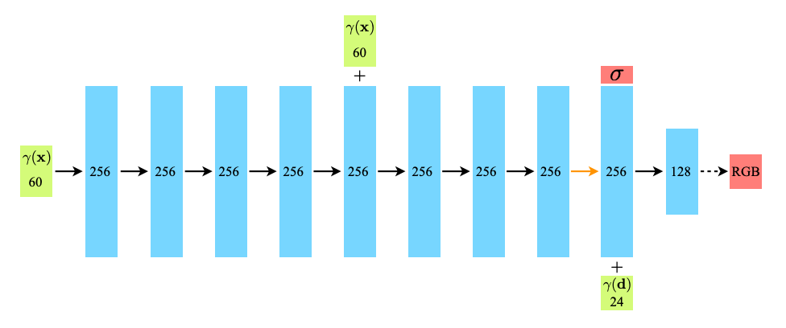

# NeRF 代码学习

!!! abstract "Abstract"
    NeRF 的代码学习(学习的是Pytorch实现版本)

    源代码: :simple-github: [nerf-pytorch](https://github.com/yenchenlin/nerf-pytorch)

    Pytorch版本代码解读: [Blog](https://yconquesty.github.io/blog/ml/nerf/nerf_rendering.html#analysis)

    我的复现代码: :simple-github: [Learning NeRF](https://github.com/cxzhou35/learning_nerf)

    <p align="right">-- By @Zicx</p>

## 数据集

```
./scene/
├── train
│   ├── r_0.png
│   ├── r_1.png
│   └── ...
├── val
│   ├── r_0.png
│   ├── r_1.png
│   └── ...
├── test
│   ├── r_0.png
│   ├── r_1.png
│   └── ...
├── transforms_train.json
├── transforms_val.json
└── transforms_test.json
```

**camera_angle_x: 水平视场角**

**frames**

- file_path: 每一张照片的路径
- rotation: 旋转角，用来计算焦距
- transform_matrix: 从相机坐标系到世界坐标系的变换矩阵

**坐标系**

- 相机坐标系：[right, up, backward] 即 [x, y, z]
- COLMAP 坐标系：[right, down, forward] 即 [x, -y, -z]

## 代码结构

```
.
├── configs                     # 各个 scene 的配置参数
│   ├── chair.txt
│   ├── drums.txt
│   ├── ...
│   └── trex.txt
├── download_example_data.sh    # 下载数据集的脚本
├── load_LINEMOD.py             # 加载 LINEMOD 数据集
├── load_blender.py             # 加载 blender 数据集
├── load_deepvoxels.p           # 加载 deepvoxels 数据集
├── load_llff.py                # 加载 LLFF 数据集
├── requirements.txt            # Python 环境配置
├── nerf_configs                # NeRF 任务参数*
├── nerf_models                 # NeRF 模型定义*
├── nerf_render                 # NeRF 训练网络，渲染过程*
├── nerf_inference              # NeRF 推理*
├── run_nerf.py                 # NeRF 核心代码*
└── run_nerf_helpers.py         # NeRF 辅助代码
```

## 实现过程

1. 在 `nerf_configs` 文件中配置好所有的任务参数
    对于每一个场景，有一个单独的配置文件(./configs/scene.txt)，可以在这个配置文件中写入需要使用的参数

2. 在 `load_blender` 中定义了如何**加载合成类型的数据集**的方式
    1. 读取图片(`imgs`)和对应的变换矩阵(`poses`)
    2. 计算**相机参数**(`H, W, focal`)
    3. 计算**渲染位姿**(`render_poses`) [-180, 180] 间隔 9 度采样
    4. **划分数据集**范围(`i_split`: train/val/test)

3. 在 `nerf_models` 中定义了 `NeRF` 网络的类
    1. 网络结构
    2. 前向传播

4. 在 `run_nerf_helper` 中定义了很多辅助函数，用于 NeRF 使用
    1. 定义了 `Embedder` 这个用于**编码的类**
    2. `get_embedder` 获得输入数据对应的**编码函数**和**输出维度**
    3. `get_rays` 获得**所有光线的信息**: `rays_o`, `rays_d`
    4. `sample_pdf` 用于**分层采样**，根据累积密度函数获得**分布密度高的采样点集合**
    5. `ndc_rays` 用于将光线从 3D 空间坐标系**转换到 NDC 坐标系**

5. 在 `run_nerf` 中定义了 NeRF 如何训练
    1. 在 `create_nerf` 中，创建 NeRF 的神经网络，获得编码函数，设定训练参数，并定义了一个 lambda 函数 `network_query_fn` 作为接收参数，开始训练的入口，此时还没训练
    2. `run_network` 被 lambda 函数调用后**开始训练网络**，对输入数据进行编码，传递给 MLP，获得输出结果

6. 在 `nerf_render` 中定义了渲染和输出的过程
    1. 先通过 `get_rays` 函数获得对应的光线
    2. `batchify_rays` 对光线分批处理
    3. `render_rays` 函数进行体渲染
    4. `raw2outputs` 函数会将体渲染的结果转化为一些数值（rgb 值，视差，深度，权重）输出

## 网络模型

一共有两个 MLP 模型：coarse、fine

- coarse
    - input: rays, view_dirs
    - output: $\sigma$, $RGB_{coarse}$

- fine
    - input: $\sigma$, $RGB_{coarse}$
    - output: $RGB_{fine}$

<figure markdown>
  { width="550" }
  <figcaption>Fig1. MLP architecture of NeRF</figcaption>
</figure>

```
1. pts_linears (256 + 63 = 319)
ModuleList(
  (0): Linear(in_features=63, out_features=256, bias=True)
  (1): Linear(in_features=256, out_features=256, bias=True)
  (2): Linear(in_features=256, out_features=256, bias=True)
  (3): Linear(in_features=256, out_features=256, bias=True)
  (4): Linear(in_features=256, out_features=256, bias=True)
  (5): Linear(in_features=319, out_features=256, bias=True)  # combine 256+63
  (6): Linear(in_features=256, out_features=256, bias=True)
  (7): Linear(in_features=256, out_features=256, bias=True)
)

2. alpha_linear
Linear(in_features=256, out_features=1, bias=True)

3. feature_linear
Linear(in_features=256, out_features=256, bias=True)

4. views_linears (256 + 27 = 283)
ModuleList(
  (0): Linear(in_features=283, out_features=128, bias=True)
)

5. rgb_linear
Linear(in_features=128, out_features=3, bias=True)
```
