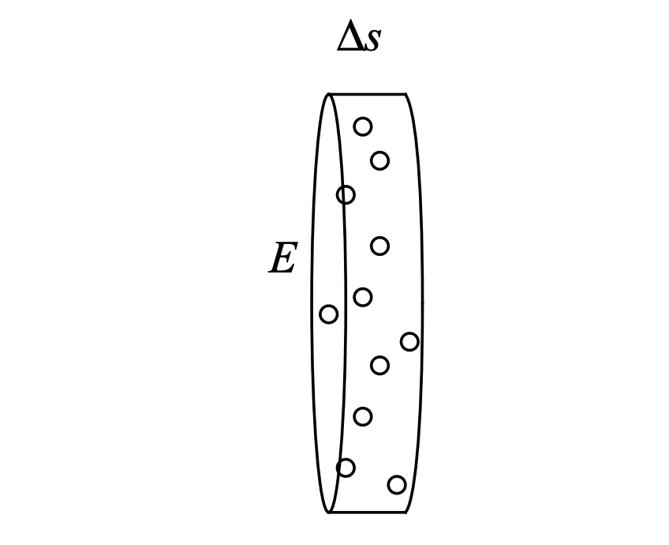
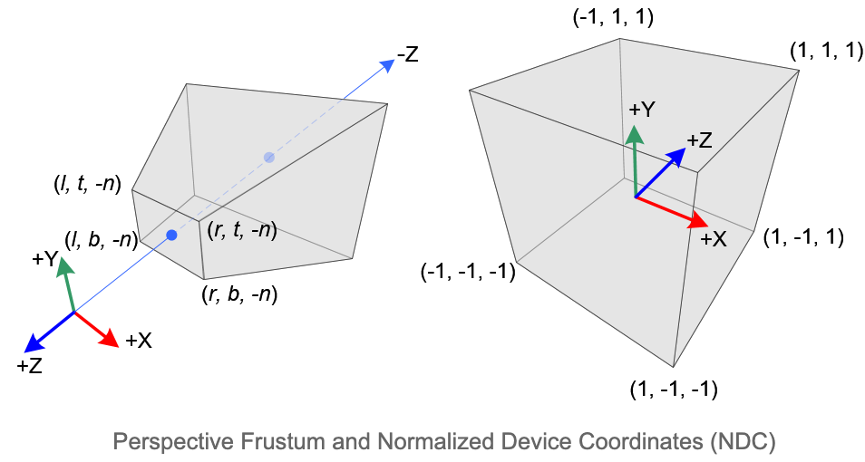
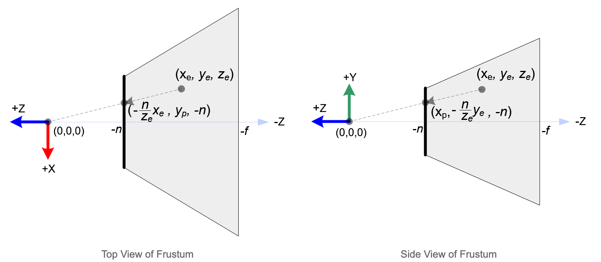
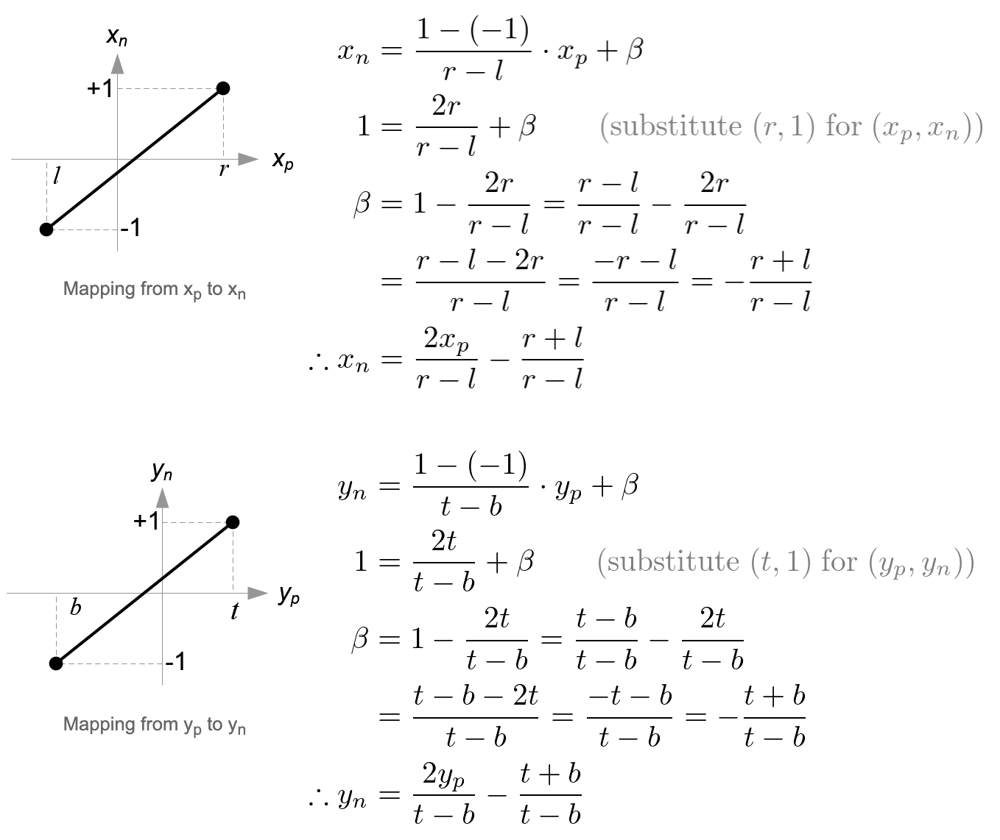

# NeRF 数学推导
!!! abstract "Abstract"
    NeRF 论文中有关数学公式的推导

    参考的Blog: [NeRF: A Volume Rendering Perspective](https://yconquesty.github.io/blog/ml/nerf/nerf_rendering.html)

    
-- By @Zicx

> 关于volume rendering的讲解，可以看这个视频 [:simple-youtube:](https://www.youtube.com/watch?v=hiaHlTLN9TE)

## 透射率的推导

设密度场为 $\sigma(\mathbf{x})$，其中 $\mathbf{x} \in \mathbb{R}^3$，由于沿射线传播的任何空间点 $\mathbf{x}$ 都可以写成以下射线的形式：

$$
\mathbf{r}(t) = \mathbf{o} + t \mathbf{d}
$$

于是可以重新参数化沿给定**射线 $\mathbf{r}=\left(\mathbf{o}, \mathbf{d}\right)$ 的密度函数**为一个**标量函数** $\sigma(t)$
密度与**透射率函数** $T(t)$ 密切相关，它表示光线在区间 $[0,t)$ 上传播而**没有击中任何粒子 (没有发生碰撞)** 的概率

现在考虑光线从位置 $t$ 传播了 $d t$ 距离的过程，**若这个过程中没有击中粒子**，则有下式成立：

$$
T(t+dt) = T(t)\cdot \left(1-dt \cdot \sigma(t)\right)
$$

- $T(t+dt)$ 是光线在区间 $[0,t+dt)$ 内没有碰撞的概率
- $T(t)$ 是光线在区间 $[0,t)$ 内没有碰撞的概率
- $1-dt \cdot \sigma(t)$ 是光线在区间 $[t,t+dt)$ 内没有碰撞的概率
- 符合乘法原理

移项化简上面的表达式，可以得到下面这个微分方程：

$$
T^{\prime}(t)=-T(t) \cdot \sigma(t)
$$

求解得到：

$$
T(a \rightarrow b) \equiv \frac{T(b)}{T(a)}=\exp \left(-\int_a^b \sigma(t) d t\right)
$$

**$T(a \rightarrow b)$ 定义为光线从距离 $a$ 到距离 $b$ 而没有碰到粒子的概率**，与 NeRF 中的透过率的概念对应

> 一般把 $1-T(t)$ 称为**不透明度**，解释为**累积分布函数（CDF）**，表示射线在某时刻前到达距离 $t$ 处并在途中**击中过粒子的概率**，$T(t) \cdot \sigma(t)$ 是相应的**概率密度函数（PDF）**，它表示射线在距离 $t$ 处刚好停止的概率

???+ warning "Tips"
    下文的 **“颜色积分推导”** 部分中也涉及到透射率 $T(t)$ 的推导（根据 Max 的论文），但我觉得上述的这个模型更加容易理解，且更加准确一点

## 颜色积分的推导

> 参考 1995 年 Max 的论文

### 一、仅考虑吸收光（无散射、反射）

<figure markdown>
  { width="350" }
  <figcaption>Fig1. A slab of base area E and thickness ∆s.</figcaption>
</figure>

假设粒子都是半径为 $r$ ，投影面积 $A = \pi r^2$ 的相同球体，$\rho$  表示单位体积内的粒子数
考虑一个小圆柱形的底板，底部的面积为 $E$ ，底板的厚度为 $\Delta s$，光沿着垂直底面的方向 $\Delta s$  流动。底板的体积 $V=E \Delta s$，至少包含的粒子数目 $N = \rho E \Delta s$，**如果底板足够薄使得底面上的粒子投影很少重叠**，那么这些粒子在底板上遮挡的总面积可以用 $NA = \rho AE \Delta s$ 表示

则被遮挡的光线的比例可以计算：

$$
\eta = \frac{\rho AE \Delta s}{E} = \rho A \Delta s
$$

进一步估计，当 $\Delta s \rightarrow 0$ 时，**且粒子的重叠概率为 0 时**，有如下微分方程成立：

$$
\frac{d I}{d s}=-\rho(s) A I(s)=-\tau(s) I(s)
$$

上式中，$s$ 是沿着光流方向的一条射线上的**长度参数**，$I(s)$ 是距离为 $s$ 处的**光强度**
$\tau(s) = \rho(s) A$ 是**消光系数**，**定义了光线被遮挡的比例**，上述微分方程的解如下：

$$
I(s)=I_0 \exp \left(-\int_0^s \tau(t) d t\right)
$$

$I(0)$ 是 $s = 0$ 处的光强度，是光线刚接触物体时的**初始强度**

从上式中可以提取出一个量：

$$
T(s) = \exp \left(-\int_0^s \tau(t) d t\right)
$$

> 这个量是从距离 $0 \rightarrow s$ 的**透射率**

从透射率引出了**体素的不透明度** $\alpha$，假设体素的边长为 $l$ ，当沿着一条边平行观察时：

$$
\alpha = 1 - T(l) = 1 - \exp\left(-\int_0^l \tau(t) d t\right)
$$

### 二、仅考虑发射光（无吸收）

如果 Fig1 中的粒子是透明的，但以每单位投影面积强度为 $C$ 在发光，则前文推导得出的投影面积 $\rho A E \Delta s$ 将会为底面 $E$ 贡献一个发光通量 $C \rho A E \Delta s$，对于底面上每单位面积，增加的通光量为 $C \rho A \Delta s$，则有以下微分方程成立：

$$
\frac{d I}{d s}=C(s) \rho(s) A=C(s) \tau(s)=g(s)
$$

这里的 $g(s)$ 被称为**源项**，后面还会继续讨论它，包括反射、发射等，上述微分方程的解如下：

$$
I(s)=I_0+\int_0^s g(t) d t
$$

### 三、考虑吸收和发射

合并一、二两个模型中的两个微分方程，可以得到以下微分方程：

$$
\frac{d I}{d s} =g(s)-\tau(s) I(s)
$$

> 这里源项 $g(s)$ 是位置的任意函数，不再是之前的形式了

在上式左右同乘一个式子，得到如下方程：

$$
\left(\frac{d I}{d s}+\tau(s) I(s)\right) \exp \left(\int_0^s \tau(t) d t\right)=g(s) \exp \left(\int_0^s \tau(t) d t\right)
$$

上式左边是两个乘积的微分，可以合并：

$$
\frac{d}{d s}\left(I(s) \exp \left(\int_0^s \tau(t) d t\right)\right)=g(s) \exp \left(\int_0^s \tau(t) d t\right)
$$

从 $s = 0$ 积分到 $s = D$：

$$
I(D) \exp \left(\int_0^D \tau(t) d t\right)-I_0=\int_0^D\left(g(s) \exp \left(\int_0^s \tau(t) d t\right)\right) d s
$$

移项后化简，可以得到：

$$
I(D)=I_0 \exp \left(-\int_0^D \tau(t) d t\right)+\int_0^D g(s) \exp \left(-\int_s^D \tau(t) d t\right) d s
$$

> 上式的第一项是**背景光源的光强**，第二项是源项 $g(s)$ 在每个位置上的贡献积分

写成透射率相关的形式如下所示：

$$
I(D)=I_0 T(D)+\int_0^D g(s) T(s) d s
$$

对比 NeRF 中的颜色积分公式

$$
C(\mathbf{r})=\int_{t_n}^{t_f} T(t) \sigma(\mathbf{r}(t)) \mathbf{c}(\mathbf{r}(t), \mathbf{d}) d t, \text{ where } T(t)=\exp \left(-\int_{t_n}^t \sigma(\mathbf{r}(s)) d s\right)
$$

我们可以发现：

- NeRF 忽略了背景光源带来的光强影响
- NeRF 把源项 $g(s)$ 写成了 $\sigma(\mathbf{r}(t))\cdot\mathbf{c}(\mathbf{r}(t),\mathbf{d})$ 的形式，其中 $\sigma$ 是概率密度函数
 
此外这个公式和 NeRF 中的公式不一样，一个重要的原因是**坐标系不同**，在 NeRF 中**相机中心为坐标原点**

???+ note "Note"
    从**概率的角度**解释，$T(t) \cdot \sigma(t)$ 是光线在距离 $t$ 处停下的概率，$c(t)dt$ 是光线在距离 $t$ 处的颜色

## 分段体积渲染推导

### 一、计算分段体积的颜色

文中假设了场景在一小块射线段 $[a,b]$ 内为同质均匀介质，具有恒定颜色 $\mathbf{c}_a$ 和 密度 $\sigma_a$
体积介质的颜色可以如下计算：

$$
\begin{aligned}
\boldsymbol{C}(a \rightarrow b) & =\int_a^b T(a \rightarrow t) \cdot \sigma(t) \cdot \mathbf{c}(t) d t \\
& =\sigma_a \cdot \mathbf{c}_a \int_a^b T(a \rightarrow t) d t \\
& =\sigma_a \cdot \mathbf{c}_a \int_a^b \exp \left(-\int_a^t \sigma(u) d u\right) d t \\
& =\sigma_a \cdot \mathbf{c}_a \int_a^b \exp \left(-\left.\sigma_a u\right|_a ^t\right) d t \\
& =\sigma_a \cdot \mathbf{c}_a \int_a^b \exp \left(-\sigma_a(t-a)\right) d t \\
& =\left.\sigma_a \cdot \mathbf{c}_a \cdot \frac{\exp \left(-\sigma_a(t-a)\right)}{-\sigma_a}\right|_a ^b \\
& =\mathbf{c}_a \cdot\left(1-\exp \left(-\sigma_a(b-a)\right)\right)
\end{aligned}
$$

> 这个式子说明，如果是**分段连续的介质**，它在某一段内最终的颜色等于初始颜色与一个密度相关的**常数**的乘积（这也为后续的可微优化奠定了基础）

### 二、计算分段体积的透射率

给定一组区间 $\{[t_i,t_{i+1}]\}_{i=1}^{N}$，假设在第 $i$ 段区间内介质具有恒定密度 $\sigma_i$，设 $t_{1}=0$ 和 $\delta_{i} = t_{i+1} - t_{i}$，则透射率的表达式如下：

$$
T_i=T\left(t_i\right)=T\left(0 \rightarrow t_i\right)=\exp \left(-\int_0^{t_i} \sigma(t) d t\right)=\exp \left(\sum_{j=1}^{i-1}-\sigma_j \delta_j\right)
$$

> 这里使用了**微分**的思想离散地计算这个积分值

### 三、分段体积的渲染

结合第一部分和第二部分的计算结果，我们可以通过具有**分段常数颜色和密度**的介质来进行立体渲染计算最后的颜色：

$$
\begin{aligned}
\boldsymbol{C}\left(t_{N+1}\right) & =\sum_{i=1}^N \int_{t_i}^{t_{i+1}} T(t) \cdot \sigma_i \cdot \mathbf{c}_i d t \\
& =\sum_{i=1}^N \int_{t_i}^{t_{i+1}} T\left(0 \rightarrow t_i\right) \cdot T\left(t_i \rightarrow t\right) \cdot \sigma_i \cdot \mathbf{c}_i d t \\
& =\sum_{i=1}^N T\left(0 \rightarrow t_i\right) \int_{t_i}^{t_{i+1}} T\left(t_i \rightarrow t\right) \cdot \sigma_i \cdot \mathbf{c}_i d t \\
& =\sum_{i=1}^N T\left(0 \rightarrow t_i\right) \cdot\left(1-\exp \left(-\sigma_i\left(t_{i+1}-t_i\right)\right)\right) \cdot \mathbf{c}_{i}\\
& =\sum_{i=1}^N T\left(0 \rightarrow t_i\right) \cdot\left(1-\exp \left(-\sigma_{i} \delta_{i}\right)\right) \cdot \mathbf{c}_i
\end{aligned}
$$

对这个表达式的一些补充说明，对于第 $i$ 个区间 $[t_{i},t_{i+1}]$：

- $T(0 \rightarrow t_{i})$ 是光线可以到达这个区间的**概率**
- $1-\exp(-\sigma_{i} \delta_{i})$ 是光线经过这段区间的**折损率**
- $c_i$ 是距离 $t_{i}$ 处 **(区间入射点)的颜色**

> *简单理解*：一束光首先要到达这个区域，然后经过这个区域的时候会有一些折损，最后要计算出射的时候的颜色

原文中 NeRF 中的表达式是这样的：

$$
\hat{C}(\mathbf{r})=\sum_{i=1}^N T_i\left(1-\exp \left(-\sigma_i \delta_i\right)\right) \mathbf{c}_i, \text { where } T_i=\exp \left(-\sum_{j=1}^{i-1} \sigma_j \delta_j\right)
$$

最后，我们可以用 Alpha 合成权重 $\alpha_{i}=1-\exp({-\sigma_{i} \delta_{i})}$ 来重写上述式子：

$$
\boldsymbol{C}\left(t_{N+1}\right)=\sum_{n=i}^N T_i \cdot \alpha_i \cdot \mathbf{c}_i, \quad \text { where } \quad T_i=\prod_{i=1}^{N-1}\left(1-\alpha_i\right)
$$

## 射线空间NDC 坐标系推导

NDC (Normalized Device Coordinate，归一化设备空间坐标系)

> 这个坐标系是以**相机为原点**的[-1, 1]的一个**三维空间坐标系**，不再区别 perspective 和 orthographics 投影，这个坐标系将真实世界 near--far 的空间压缩的一个**相对坐标系**，坐标值不具有空间的物理意义

从相机空间到 NDC 空间的变换，用于齐次坐标的 3D 透视投影矩阵：

$$
M=\left(\begin{array}{cccc}
\frac{n}{r} & 0 & 0 & 0 \\
0 & \frac{n}{t} & 0 & 0 \\
0 & 0 & \frac{-(f+n)}{f-n} & \frac{-2 f n}{f-n} \\
0 & 0 & -1 & 0
\end{array}\right)
$$

- $n$ 和 $f$ 是**近场和远场裁剪平面的位置**
- $r$ 和 $t$ 是场景在**近场裁剪平面右侧和顶部的边界**
- 需要注意，这是在**相机中心朝向 $-z$ 方向**下的规定

**如何推导出 M 矩阵（透视投影矩阵）？**

> 参考 [OpenGL Projection Matrix](http://www.songho.ca/opengl/gl_projectionmatrix.html)

<figure markdown>
  { width="550" }
  <figcaption>Fig2. Perspective Frustum and NDC.</figcaption>
</figure>

首先需要明确的是，M 矩阵集成了**裁剪 3D 坐标系和转化到 NDC 空间的功能**

**所以现在的坐标系有三个，依次为：3D 空间坐标系 --> 裁剪坐标系 --> NDC 坐标系**

3D 空间坐标系又可以叫做人眼坐标系，三个坐标系之间的关系如下：

$$
\begin{aligned}
\left(\begin{array}{c}
x_{\text {clip }} \\
y_{\text {clip }} \\
z_{\text {clip }} \\
w_{\text {clip }}
\end{array}\right)=M_{p r o j e c t i o n} \cdot\left(\begin{array}{c}
x_{\text {eye }} \\
y_{\text {eye }} \\
z_{\text {eye }} \\
w_{\text {eye }}
\end{array}\right) \\
\\
\left(\begin{array}{l}
x_{n d c} \\
y_{n d c} \\
z_{n d c}
\end{array}\right)=\left(\begin{array}{l}
x_{\text {clip }} / w_{c l i p} \\
y_{c l i p} / w_{c l i p} \\
z_{c l i p} / w_{c l i p}
\end{array}\right)
\end{aligned}
$$

> **这里人眼坐标系和裁剪坐标系的坐标都用齐次坐标来表示**

3D 空间坐标系是**右手坐标系**，而 NDC 空间使用的是**左手坐标系**，它们的 z 轴方向是相反的，在 3D 空间坐标系中，**相机中心在原点，观察方向为 z 轴的负方向**

3D 空间坐标系中的一个 3D 点会被投影在近平面(near plane，又叫投影平面）上

下图展示了 3D 空间点 $(x_{e},y_{e},z_{e})$ 如何投影到近平面上变成点 $(x_{p},y_{p})$

<figure markdown>
  { width="550" }
  <figcaption>Fig3. 3D Projection.</figcaption>
</figure>

从不同坐标轴视角来看，根据相似三角形，可以得到如下的坐标：

$$
\begin{aligned}
x_p=\frac{-n \cdot x_e}{z_e}=\frac{n \cdot x_e}{-z_{e}}\\
y_p=\frac{-n \cdot y_e}{z_e}=\frac{n \cdot y_e}{-z_{e}}
\end{aligned}
$$

我们将裁剪坐标系的第四个分量设置为 $-z_{e}$，这样 M 矩阵的第四行变成了 $(0,0,-1,0)$

接下来，将 $x_{p}$ 和 $y_{p}$ 映射到 NDC 坐标系中的 $x_{n}$ 和 $y_{n}$，利用的映射关系是：

$$
[l, r] \rightarrow [-1, 1] \quad \text{and} \quad [b, t] \rightarrow [-1, 1]
$$

<figure markdown>
  { width="550" }
  <figcaption>Fig4. Formula deduction for mapping.</figcaption>
</figure>

代入之前求得的 $x_{p}$ 和 $y_{p}$ 的值，我们可以得到 $(x_{n},y_{n})$ 的表达式：

$$
\begin{aligned}
x_{n} = (\underbrace{\frac{2 n}{r-l} \cdot x_e+\frac{r+l}{r-l} \cdot z_e}_{x_c}) /-z_{e}\\
y_{n} = (\underbrace{\frac{2 n}{t-b} \cdot y_e+\frac{t+b}{t-b} \cdot z_e}_{y_c}) /-z_e
\end{aligned}
$$

由于之前我们已经设裁剪坐标系的第四个分量为 $-z_{e}$，于是这里直接可以不考虑分母，得到 M 矩阵的第一行和第二行分别为：

$$
\begin{aligned}
\left(\begin{array}{cccc}
\frac{2 n}{r-l} & 0 & \frac{r+l}{r-l} & 0 \\
0 & \frac{2 n}{t-b} & \frac{t+b}{t-b} & 0 \\
. & . & . & . \\
0 & 0 & -1 & 0
\end{array}\right)
\end{aligned}
$$

最后只需要计算第三行就可以得到 M 矩阵的完整表达式

因为 $z$ 与 $x$ 和 $y$ 无关，我们可以借助 $w$ 分量来寻找 $z_{n}$ 和 $z_{e}$ 的关系

利用**待定系数法**，设 M 矩阵为：

$$
\left(\begin{array}{l}
x_c \\
y_c \\
z_c \\
w_c
\end{array}\right)=\left(\begin{array}{cccc}
\frac{2 n}{r-l} & 0 & \frac{r+l}{r-l} & 0 \\
0 & \frac{2 n}{t-b} & \frac{t+b}{t-b} & 0 \\
0 & 0 & A & B \\
0 & 0 & -1 & 0
\end{array}\right)\left(\begin{array}{l}
x_e \\
y_e \\
z_e \\
w_e
\end{array}\right)
$$

> 其中 $A, B$ 是待解的参数

在人眼坐标系中 $w_{e} = 1$，代入解得：

$$
z_n=\frac{A z_e+B}{-z_e}
$$

为了计算参数 $A$ 和 $B$, 可以利用 $z_{e}, z_{n}$ 的关系：$(-n, -1)$ 和 $(-f, 1)$

代入可列出方程组：

$$
\left\{\begin{array} { l } 
{ \frac { - A n + B } { n } = - 1 } \\
{ \frac { - A f + B } { f } = 1 }
\end{array} \rightarrow \left\{\begin{array}{l}
-A n+B=-n \\
-A f+B=f
\end{array}\right.\right.
$$

解得参数 $A$ 和 $B$ 后可以得到完整的 M 矩阵表达式如下：

$$
\left(\begin{array}{cccc}
\frac{2 n}{r-l} & 0 & \frac{r+l}{r-l} & 0 \\
0 & \frac{2 n}{t-b} & \frac{t+b}{t-b} & 0 \\
0 & 0 & \frac{-(f+n)}{f-n} & \frac{-2 f n}{f-n} \\
0 & 0 & -1 & 0
\end{array}\right)
$$

如果人眼空间是对称的，即 $l = -r, b = -t$，则 M 矩阵可以写成如下形式：

$$
\left(\begin{array}{cccc}
\frac{n}{r} & 0 & 0 & 0 \\
0 & \frac{n}{t} & 0 & 0 \\
0 & 0 & \frac{-(f+n)}{f-n} & \frac{-2 f n}{f-n} \\
0 & 0 & -1 & 0
\end{array}\right)
$$

> 可以看到和 NeRF 中给出的公式是一致的

有了透视投影矩阵 M 之后，我们可以将3D 齐次坐标投影到 NDC 坐标系中：

$$
\begin{aligned}
&\left(\begin{array}{cccc}
\frac{n}{r} & 0 & 0 & 0 \\
0 & \frac{n}{t} & 0 & 0 \\
0 & 0 & \frac{-(f+n)}{f-n} & \frac{-2 f n}{f-n} \\
0 & 0 & -1 & 0
\end{array}\right)\left(\begin{array}{l}
x \\
y \\
z \\
1
\end{array}\right)=\left(\begin{array}{c}
\frac{n}{r} x \\
\frac{n}{t} y \\
\frac{-(f+n)}{f-n} z-\frac{-2 f n}{f-n} \\
-z
\end{array}\right) \\
& \text { project } \rightarrow\left(\begin{array}{c}
\frac{n}{r} \frac{x}{-z} \\
\frac{n}{t} \frac{y}{-z} \\
\frac{(f+n)}{f-n}-\frac{2 f n}{f-n} \frac{1}{-z}
\end{array}\right)
\end{aligned}
$$

**投影之后得到的点是位于 NDC 空间中的，且原始视锥体已被映射到立方体 $\left[-1,1 \right]^3$ 上（因为做了裁剪）**

现在将 3D 空间中的射线 $\mathbf{r} = \mathbf{o} + t \mathbf{d}$ 投影到 NDC 空间中，对应为 $\mathbf{r}^{\prime} = \mathbf{o}^{\prime} + t^{\prime} \mathbf{d}^{\prime}$ 

将得到的 NDC 空间中的投影点坐标写成这个形式：$\left(a_x x / z, a_y y / z, a_z+b_z / z\right)^{\top}$ 

> *$a_{x},a_{y},a_{z},b_{z}$ 都是参数，为了书写表达式方便，后续会代入具体的客观值*

NDC 空间中光线 $\mathbf{r}^{\prime}$ 的参数分量 $(r_{x},r_{y},r_{z})$ 满足下式：

$$
\left(\begin{array}{c}
a_x \frac{o_x+t d_x}{o_z+t d_z} \\
a_y \frac{o_y+t d_y}{o_z+t d_z} \\
a_z+\frac{b_z}{o_z+t d_z}
\end{array}\right)=\left(\begin{array}{c}
o_x^{\prime}+t^{\prime} d_x^{\prime} \\
o_y^{\prime}+t^{\prime} d_y^{\prime} \\
o_z^{\prime}+t^{\prime} d_z^{\prime}
\end{array}\right)
$$

其中，$\mathbf{r}_{i} = o_{i}+t\textbf{d}_{i},\quad \mathbf{r}^{\prime}_{i} = \mathbf{o}^{\prime}_{i} + t^{\prime} \mathbf{d}^{\prime}_{i}, \quad i=x,y,z$ 

为了消除一个自由度，将 $t^{\prime}=0$ 和 $t=0$ 映射到同一点，则在 NDC 坐标系下光线中心的坐标为：

$$
\mathbf{o}^{\prime}=\left(\begin{array}{c}
o_x^{\prime} \\
o_y^{\prime} \\
o_z^{\prime}
\end{array}\right)=\left(\begin{array}{c}
a_x \frac{o_x}{o_z} \\
a_y \frac{o_y}{o_z} \\
a_z+\frac{b_z}{o_z}
\end{array}\right)
$$

将光线中心的坐标代入到之前的表达式中，得到：

$$
\begin{aligned}
\left(\begin{array}{c}
t^{\prime} d_x^{\prime} \\
t^{\prime} d_y^{\prime} \\
t^{\prime} d_z^{\prime}
\end{array}\right) & =\left(\begin{array}{c}
a_x \frac{o_x+t d_x}{o_z+t d_z}-a_x \frac{o_x}{o_z} \\
a_y \frac{o_y+t d_y}{o_z+t d_z}-a_y \frac{o_y}{o_z} \\
a_z+\frac{b_z}{o_z+t d_z}-a_z-\frac{b_z}{o_z}
\end{array}\right) \\
&=\left(\begin{array}{c}
a_x \frac{t d_z}{o_z+t d_z}\left(\frac{d_x}{d_z}-\frac{o_x}{o_z}\right) \\
a_y \frac{t d_z}{o_z+t d_z}\left(\frac{d_y}{d_z}-\frac{o_y}{o_z}\right) \\
-b_z \frac{t d_z}{o_z+t d_z} \frac{1}{o_z}
\end{array}\right)
\end{aligned}
$$

观察三个分量，可以发现 $t^{\prime}$ 的表达式如下：

$$
t^{\prime}=\frac{t d_z}{o_z+t d_z}=1-\frac{o_z}{o_z+t d_z}
$$

同除 $t^{\prime}$ 之后也得到了 $\mathbf{d}^{\prime}$ 的表达式，如下：

$$
\mathbf{d}^{\prime}=\left(\begin{array}{c}
a_x\left(\frac{d_x}{d_z}-\frac{o_x}{o_z}\right) \\
a_y\left(\frac{d_y}{d_z}-\frac{o_y}{o_z}\right) \\
-b_z \frac{1}{o_z}
\end{array}\right)
$$

在推导的过程中，我们使用的常数最后需要确定下来，如下：

$$
\begin{aligned}
a_x & =-\frac{n}{r} \\
a_y & =-\frac{n}{t} \\
a_z & =\frac{f+n}{f-n} \\
b_z & =\frac{2 f n}{f-n}
\end{aligned}
$$

基于**标准针孔相机模型**，我们可以将 $a_{x},a_{y}$ 的表达式如下参数化：

$$
\begin{aligned}
& a_x=-\frac{f_{c a m}}{W / 2} \\
& a_y=-\frac{f_{c a m}}{H / 2}
\end{aligned}
$$

- $W$ 和 $H$ 是**以像素为单位的图像的宽度和高度**
- $f_{cam}$ 是**相机的焦距**

在实际的场景捕获中，假设远场的边界为无穷大，基于这样的假设，$a_{z}$ 和 $b_{z}$ 的表达式如下：

$$
\begin{aligned}
a_z & =1 \\
b_z & =2 n
\end{aligned}
$$

最后，代入上述常量参数，我们最后求得的 NDC 座标系下的光线坐标为：

$$
\begin{aligned}
& \mathbf{o}^{\prime}=\left(\begin{array}{c}
-\frac{f_{c a m}}{W / 2} \frac{o_x}{o_z} \\
-\frac{f_{c a m}}{H / 2} \frac{o_y}{o_z} \\
1+\frac{2 n}{o_z}
\end{array}\right) \\
& \mathbf{d}^{\prime}=\left(\begin{array}{c}
-\frac{f_{c a m}}{W / 2}\left(\frac{d_x}{d_z}-\frac{o_x}{o_z}\right) \\
-\frac{f_{c a m}}{H / 2}\left(\frac{d_y}{d_z}-\frac{o_y}{o_z}\right) \\
-2 n \frac{1}{o_z}
\end{array}\right)
\end{aligned}
$$

至此，我们完成了 NDF 坐标系下光线坐标的推导
整个过程中，需要理清楚各个坐标系之间的几何关系，以及哪些量是常量，哪些量是变量参数

???+ tip "Supplementary materials"
    **一点补充：**

    NeRF 的原文中还提到了一个细节：在将光线转换到 NDC 坐标系之前，将 $\mathbf{o}$ 做了偏移，移动到了射线与 $z=-n$ 的**近平面的交点处**，这样的好处是，当光线转换到 NDC 坐标系之后，可以在 $[0,1]$ **区间内线性采样** $t^{\prime}$，以便在原始的 3D 空间中获得从 $n$ 到 $\infty$ 的**视差线性采样**

    具体取值如下：

    $$
    \begin{aligned}
    \mathbf{o}_{n} = \mathbf{o} + t_{n} \mathbf{d} \\
    t_{n} = \frac{n+o_{z}}{d_{z}}
    \end{aligned}
    $$
